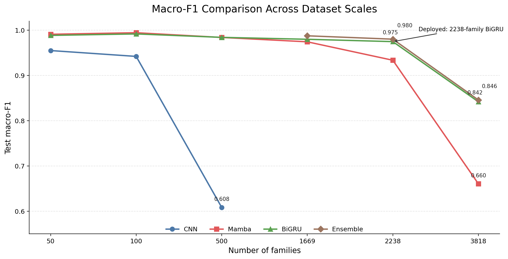
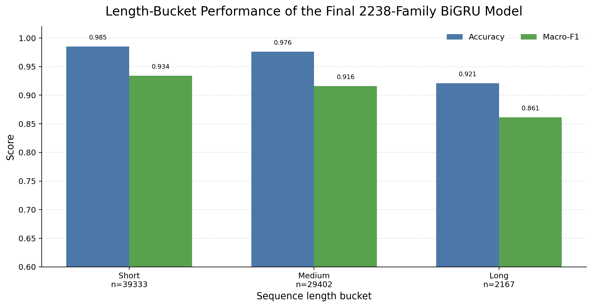

# RNA Family Classification Demo

Upload RNA sequences in FASTA or CSV format and classify them into Rfam families using a trained BiGRU sequence model.

This project is a lightweight RNA family classification demo/tool. It packages data preparation results, trained sequence models, a prediction script, and a Flask web interface into a single deployable workflow.

## Final deployed model

The deployed demo uses a BiGRU classifier trained on 2,238 Rfam families.

- Test accuracy: `0.9794`
- Test macro-F1: `0.9746`
- Maximum input length: `1024 nt`

This model was selected because it provides the best balance between family coverage, prediction quality, and deployment simplicity. It uses only standard PyTorch modules and does not require `mamba-ssm` or CUDA-specific dependencies.

## Development Notes

The goal of this project is to build a practical RNA family classification demo rather than a paper-oriented benchmark. It is a learning and demonstration project aimed at making a usable tool where users can upload RNA sequences in FASTA or CSV format and classify them into Rfam families using a trained sequence model.

### Data source and filtering

Rfam family FASTA files were used as the data source. Family accessions were scanned from `RF00001` to `RF04360`.

Some accessions did not have available local FASTA files, some families only contained sequences longer than the selected maximum length threshold, and some families had too few valid sequences for stable evaluation.

Dataset construction included:

- sequence cleaning
- length filtering
- deduplication
- minimum samples per family
- maximum samples per family
- stratified train/validation/test split
- dataset validation

Key filtering settings were:

- `max_len=512` in early `50/100/500/1669-family` experiments
- `max_len=1024` in high-coverage experiments
- `min_samples_per_family=50` for the `1669-family` dataset
- `min_samples_per_family=20` for the `2238-family` dataset
- `min_samples_per_family=1` for the `3818-family` extreme-coverage dataset

The `3818-family` setting was treated as a stress test because it introduced many singleton or ultra-low-support families.

### Dataset scaling path

| Stage | Family count | max_len | min_samples_per_family | Purpose |
|---|---:|---:|---:|---|
| Initial test | 5 | 512 | manual selection | Check the end-to-end pipeline |
| Small scale | 50 | 512 | high-support families | Smoke test for training and evaluation |
| Small scale | 100 | 512 | high-support families | Compare CNN, Mamba, and BiGRU |
| Medium scale | 500 | 512 | high-support families | Check scalability |
| Stable high-quality candidate | 1669 | 512 | 50 | Stable demo candidate |
| Final deployment model | 2238 | 1024 | 20 | Best balance between coverage and reliability |
| Extreme coverage stress test | 3818 | 1024 | 1 | Stress test, not selected for deployment |

### Model comparison summary

The main model directions in this project were:

- CNN baseline
- Mamba
- BiGRU
- BiGRU + Mamba ensemble

| Setting | Model | Family count | Test accuracy | Test macro-F1 | Notes |
|---|---|---:|---:|---:|---|
| 50-family | CNN | 50 | 0.9548 | 0.9548 | Baseline |
| 50-family | BiGRU | 50 | 0.9883 | 0.9883 | Strong RNN baseline |
| 50-family | Mamba | 50 | 0.9907 | 0.9908 | Strong early result |
| 100-family | CNN | 100 | 0.9405 | 0.9419 | Baseline |
| 100-family | BiGRU | 100 | 0.9914 | 0.9916 | Strong RNN baseline |
| 100-family | Mamba | 100 | 0.9941 | 0.9942 | Slightly better than BiGRU |
| 500-family | CNN | 500 | 0.6215 | 0.6083 | Degraded at larger scale |
| 500-family | BiGRU | 500 | 0.9834 | 0.9839 | Strong medium-scale RNN result |
| 500-family | Mamba | 500 | 0.9836 | 0.9838 | Strong medium-scale result |
| 1669-family | BiGRU | 1669 | 0.9800 | 0.9797 | Stable high-quality candidate |
| 1669-family | Ensemble | 1669 | 0.9878 | 0.9874 | Best offline result for this setting |
| 2238-family | Mamba | 2238 | 0.9631 | 0.9334 | High-coverage Mamba baseline |
| 2238-family | BiGRU | 2238 | 0.9794 | 0.9746 | Final deployed model |
| 2238-family | Ensemble | 2238 | 0.9848 | 0.9800 | Best offline result, not deployed |
| 3818-family | Mamba | 3818 | 0.9374 | 0.6605 | Extreme low-support setting |
| 3818-family | BiGRU | 3818 | 0.9698 | 0.8417 | Better but still not deployment-ready |
| 3818-family | Ensemble | 3818 | 0.9744 | 0.8457 | Stress-test result only |

### Model comparison and final selection



This comparison summarizes how CNN, Mamba, BiGRU, and ensemble models behaved across different Rfam family scales. The `2238-family` BiGRU model was selected as the final deployed model because it provides a strong balance between family coverage, macro-F1 performance, and deployment simplicity. The `3818-family` setting covers more families, but many ultra-low-support classes cause a clear macro-F1 drop, making it less suitable as the default demo model.

### Final model selection

The final deployed model is the `2238-family` BiGRU classifier.

Although the BiGRU + Mamba ensemble achieved slightly higher offline macro-F1, it was not selected for deployment because it requires loading two models and introduces additional inference complexity. The `2238-family` BiGRU model was selected as the final deployment model because it provides the best balance between family coverage, prediction quality, and deployment simplicity.

In practical terms, it offers:

- strong high-coverage performance
- `test_accuracy = 0.9794`
- `test_macro_f1 = 0.9746`
- coverage of `2238` Rfam families
- only standard PyTorch modules
- no `mamba-ssm`
- no CUDA requirement
- suitability for CPU-only Docker deployment



The final `2238-family` BiGRU model remains stable across short, medium, and long RNA sequences. Long sequences are still more difficult, but the model maintains usable performance across all length buckets.

### Why 3818-family was not selected

The `3818-family` dataset was not selected as the main deployment setting because `min_samples_per_family=1` introduced many singleton and ultra-low-support families. This caused many classes to have `F1=0` and reduced macro-F1, even though overall accuracy remained high.

Therefore, the `3818-family` setting is kept as an extreme-coverage stress test rather than a production/demo model.

## Docker quick start

```bash
docker build -t rna-family-classifier .
docker run --rm -p 5000:5000 rna-family-classifier
```

Or:

```bash
docker compose up --build
```

Open the demo at:

```text
http://127.0.0.1:5000
```
## Required model files

The final deployment model is tracked with Git LFS. After cloning the repository, run:

```bash
git lfs install
git lfs pull
```

Required files:

- `runs_rfam_2238_bigru/bigru_run/best_model.pt`
- `processed_rfam_near_full_v2_1_min20_1024/label_mapping.json`
- `data/rfam_family_metadata.csv`

If the model file is missing after clone, run:

```bash
git lfs pull
```

After `git lfs pull`, these files should exist at the required paths before running Docker build or Docker Compose.

## Input formats

Supported inputs:

- FASTA
- CSV with a `sequence` column
- Optional `sequence_id` column

## Output fields

Prediction outputs include:

- `sequence_id`
- `predicted_family`
- `confidence`
- top-k family probabilities
- `risk_flag`
- downloadable CSV
